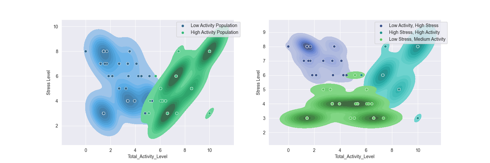

# Data Engineer & Cloud Developer 
I am a software developer who has been studying machine learning and AI since 2025. I have 6 years of experience working in an AWS environment and I have 3 years of experience in data validation and machine learning.

## Featured Projects:
### [Stress vs Physical Activity Kaggle Data Analysis](https://github.com/DanielLevenstein/stress_vs_physical_activity_data_exploration)
- Analyzed links between stress and physical data using real world data.
- Generated 3 clusters of individuals which corresponded to different stress and activity levels using k-means.
- Analyzed correlation between stress level and occupation data. 

*Figure: K-means clustering reveals distinct population-level groups based on total activity and stress.*

### [Product Profitabiltiy Study](https://github.com/DanielLevenstein/Product_Profitability_Study)
- Optimized pricing and material loss calculations for a local Etsy client.
- Generated synthetic product data based on real world material cost incurred by client.
- Compares different pricing structure to determine ideal base price needed to break even.
- Figured out material loss equation and determined how profitable multi-colored designs were.

*Figure: Calculates material waste as a function of the number of colors per design.*
