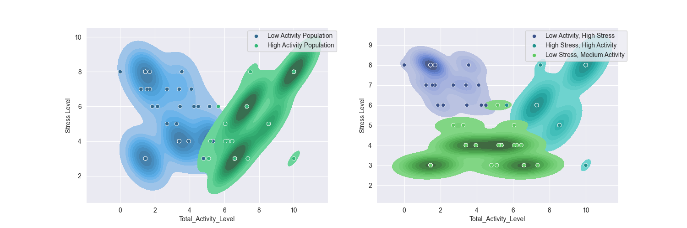
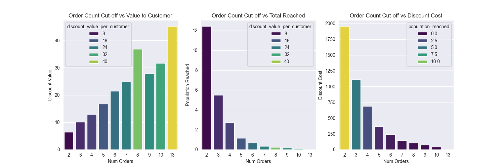
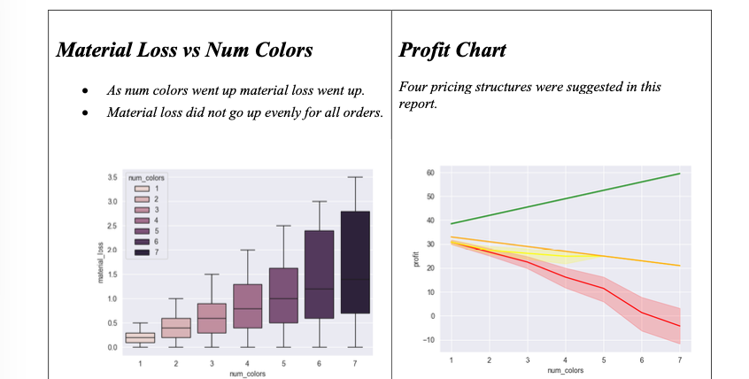

# Data Engineer & Cloud Developer

Software engineer with 6+ years of experience working in AWS environments and data systems. Recently focused on machine learning and data analysis projects including clustering, forecasting, and business analytics.

## 🛠 Deployment Experience

- 6+ years of AWS experience
- Certified AWS Cloud Practitioner (2025)
- Industry experience with data validation at Finra
- HuggingFace Models: 🔗 https://huggingface.co/DanielLevenstein
- Kaggle Data Notebooks: 🔗 https://www.kaggle.com/daniellevenstein

## Featured Projects:

### 🪖 Helmet Detection Model With Streamlit Demo

GitHub: 🔗 https://github.com/DanielLevenstein/HelmNet_ImageProcessing_UT_ML_Project6 
Live Demo: 🔗 https://huggingface.co/spaces/DanielLevenstein/Helmet_Image_Classification

Overview:

HelmNet is a convolutional neural network designed to classify whether a construction helmet is present in an image. The model was trained using TensorFlow/Keras and deployed through a Streamlit application that allows users to upload images and receive real-time predictions. The project demonstrates an end-to-end machine learning workflow including dataset preparation, model training, evaluation, and cloud deployment.

The deployed demo runs on Hugging Face Spaces and provides an interactive interface for testing the model with arbitrary images.

#### Key Contributions:

* Developed a convolutional neural network for binary helmet classification using TensorFlow and Keras.
* Implemented an image preprocessing pipeline including resizing, normalization, and array conversion to prepare images for inference.
* Built an interactive Streamlit web application allowing users to upload images and view prediction results.
* Deployed the application to Hugging Face Spaces, integrating model hosting with a live demo interface.
* Evaluated the model using random samples from the dataset and analyzed model limitations and dataset bias.
* Documented the project workflow, model architecture, and deployment process in a reproducible repository.

---

### 💪 Stress vs Physical Activity – Kaggle Data Analysis

GitHub: 🔗 https://github.com/DanielLevenstein/stress_vs_physical_activity_data_exploration 
Kaggle: 🔗 https://www.kaggle.com/daniellevenstein 

**Overview:**
Analyzed relationships between stress levels and physical activity using real-world survey data.

**Key Contributions:**

- Performed exploratory data analysis and correlation studies
- Generated three population clusters using K-Means
- Identified occupation-based stress correlations
- Visualized cluster separation and activity distribution

*Figure: K-means clustering reveals distinct population-level groups based on total activity and stress.*

---

### 🍕 FoodHub – Delivery Data Analysis

GitHub: 🔗 https://github.com/DanielLevenstein/FoodHub_UT_ML_Project1

**Overview:**
Analyzed 1,898-row food delivery dataset to evaluate cuisine performance and customer loyalty metrics.

**Key Contributions:**

- Cleaned dataset and imputed missing ratings using dataset mean
- Identified top-rated restaurants by cuisine
- Designed and evaluated discount strategy metrics
- Calculated discount cost vs. total customer reach

*Figure: Discount cost vs total reach with value per customer analysis.*

---

### 💰 Product Profitability Study

GitHub: 🔗 https://github.com/DanielLevenstein/Product_Profitability_Study

**Overview:**
Modeled pricing strategy and material loss optimization for an Etsy-based product business.

**Key Contributions:**

- Generated synthetic product dataset based on real material costs
- Modeled material loss as a function of color complexity
- Compared pricing structures to determine break-even thresholds
- Analyzed profitability of multicolor designs

*Figure: Material waste modeled as a function of colors per design.*

---

## 📫 Contact

LinkedIn: https://www.linkedin.com/in/daniel-aaron-levenstein/
