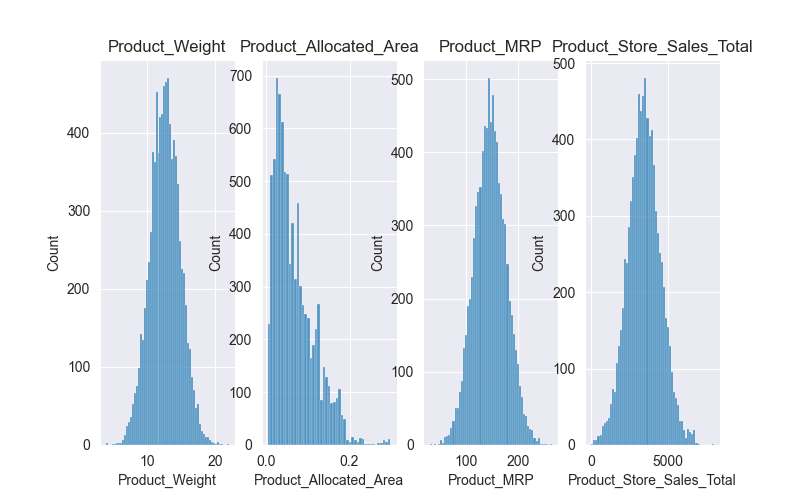
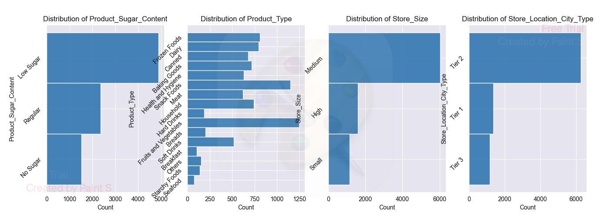

# SuperCart Store Revenue Prediction
## Project Summary
- Ingests categorical and numerical data from a csv file.
- Cleans up categorical columns and converts them to enumerations. 
- Trains product sales prediction model using gradiant boost.
- Serializes model using pickle and deploys it to Huggingface using Flask for the backend and streamlit for the frontend. 

**Frontend URL:** https://huggingface.co/spaces/DanielLevenstein/SuperCartFrontend
## Data Cleaning
- Categorical columns like ["Product_Sugar_Content", "Product_Type", "Store_Size", and "Store_Location_City_Type"] were converted to enumerations before training the model.
- Some columns like [Product_Sugar_Content] had multiple values which mapped to the same enumerations. For these columns one single value was listed in dropdown for the UI.
- A helper function was used in the Streamlit API to convert the selected categorical values to integer values prior to sending them to the backend. 

## Features Used
- "Product_Weight": Weight of the target product as float:
- "Product_Allocated_Area": Ratio display area of each product as a percentage of total display area entered as float. 
- "Product_MRP": Maximum retail price of product as float:
- "Product_Store_Sales_Total": Target variable calculated as total sales generated from a given product as float:

- "Product_Sugar_Content": Sugar content as a dropdown:
  - ["No Sugar", "Low Sugar", "Regular"]
- "Product_Type": Product type as a dropdown: 
  - [
      "Frozen Foods",
      "Dairy",
      "Canned",
      "Baking Goods",
      "Health and Hygiene",
      "Snack Foods",
      "Meat",
      "Household",
      "Hard Drinks",
      "Fruits and Vegetables",
      "Breads",
      "Soft Drinks",
      "Breakfast",
      "Others",
      "Starchy Foods",
      "Seafood"
  ]
- "Store_Size": store_size as a dropdown:
  - [
    "Small",
    "Medium",
    "High"
    ]
- "Store_Location_City_Type": Type of city store is located in as a dropdown:
  - ["Tier 1", "Tier 2", "Tier 3"]

## Conclusion

This project shows how to deploy a model on HuggingFace in a form that allows other developers to test your model using their own input data.

### Project
- Class: AI Model Deployment
- Name: Daniel Levenstein
- Submission Date: 2/15/2026